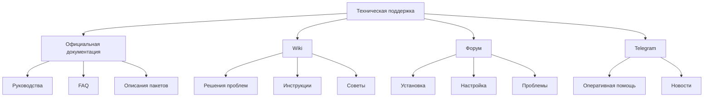

# Тема 1.1. Получение технической поддержки и работа с документацией ОС «Альт»

## 📋 Метаданные
- **Тема**: Получение технической поддержки и работа с документацией ОС «Альт»
- **Компетенции**: ОК-01, ОК-02, ОК-03, ПК-2.1, ПК-2.2, ПК-2.3, ПК-2.4
- **Время**: 80 мин | **Связь с практикой**: ЛР №3

## 🎯 Цели (ФГОС)
**Знать:**
- Основные источники технической поддержки ОС «Альт»
- Назначение и устройство систем man и info
- Структура документации ОС «Альт»

**Уметь:**
- Использовать команды для получения справки (man, info)
- Навигироваться в официальной документации и wiki
- Обращаться за помощью в сообщество

**Владеть:**
- Навыками самостоятельного поиска информации
- Умением работать с технической документацией
- Навыками использования онлайн-ресурсов поддержки

## 🕐 Тайминг (80 мин)
| Этап | Время | Содержание |
|------|-------|------------|
| Орг. момент | 5 мин | Приветствие, проверка готовности |
| Актуализация | 10 мин | Связь с предыдущим, мотивация |
| Новый материал | 45 мин | Основной контент (см. ниже) |
| Закрепление | 15 мин | Примеры, обсуждение, вопросы |
| Рефлексия | 5 мин | Key Takeaways |

## 📖 Основной контент

В процессе администрирования сетевых операционных систем, особенно ОС «Альт», системный администратор сталкивается с необходимостью быстро и эффективно решать проблемы, возникающие в работе системы. Для этого важно знать источники технической поддержки и уметь работать с документацией. Данная лекция посвящена ознакомлению с основными ресурсами, предоставляемыми разработчиками ОС «Альт», а также встроенными системами документации Linux.

### Официальные источники документации

ОС «Альт» предоставляет широкий спектр ресурсов для получения технической поддержки и документации. Это позволяет администраторам находить ответы на вопросы, связанные с установкой, настройкой и эксплуатацией системы.

Основной портал документации - https://docs.altlinux.org/. Здесь собраны руководства по установке, настройке, администрированию и использованию различных компонентов ОС «Альт». Документация включает:
- Руководства пользователя
- Администраторские руководства
- FAQ (часто задаваемые вопросы)
- Описания пакетов и программного обеспечения

### Wiki-документация

Wiki-страницы ОС «Альт» представляют собой коллективно редактируемую базу знаний. Основной ресурс - https://www.altlinux.org/. Здесь пользователи и разработчики делятся опытом, публикуют решения типичных проблем, инструкции по настройке и советы по оптимизации. Wiki полезна для поиска нестандартных решений и примеров конфигураций.

### Форум

Форум ОС «Альт» - https://forum.altlinux.org/ - является площадкой для общения пользователей и специалистов. Здесь можно задавать вопросы, делиться опытом и получать помощь от сообщества. Форум разделен на разделы по темам: установка, настройка, проблемы и решения.

### Группа в Telegram

Для оперативного общения и получения быстрой помощи существует группа в Telegram: @altlinux. В этой группе можно задавать вопросы в реальном времени, получать советы от экспертов и быть в курсе последних новостей о ОС «Альт».

## 📊 Схема: Иерархия источников документации


### Man-страницы

Man-страницы (manual pages) - это встроенная система документации в Unix-подобных системах, включая ОС «Альт».

**Назначение**: Man-страницы предназначены для получения справки по командам, конфигурационным файлам, системным вызовам и другим элементам системы. Они содержат подробные описания синтаксиса команд, опций, примеры использования и связанные темы.

**Устройство системы man**: Man-страницы организованы в разделы:
- 1: Пользовательские команды
- 2: Системные вызовы
- 3: Функции библиотек
- 4: Специальные файлы
- 5: Форматы файлов
- 6: Игры
- 7: Разное
- 8: Команды администрирования

**Пример использования**:
```bash
# Просмотр man-страницы для команды ls
man ls

# Поиск man-страницы по ключевому слову
man -k network

# Просмотр конкретного раздела
man 8 iptables
```

**Навигация в man**:
- Пробел или Page Down: следующая страница
- b или Page Up: предыдущая страница
- /<текст>: поиск текста
- q: выход

### Система info

Система info - это альтернативная система документации, разработанная проектом GNU.

**Назначение**: Info предоставляет более структурированную и гипертекстовую документацию по сравнению с man-страницами. Она предназначена для программ GNU, но также используется для других компонентов системы.

**Устройство системы info**: Info-страницы организованы в виде дерева узлов (nodes). Каждый узел содержит информацию по конкретной теме и ссылки на подтемы.

**Пример использования**:
```bash
# Просмотр info-страницы для Bash
info bash

# Навигация по узлам
info coreutils
```

**Навигация в info**:
- Стрелки: перемещение по тексту
- Tab: переход к следующей ссылке
- Enter: следовать по ссылке
- n: следующий узел
- p: предыдущий узел
- u: вверх по дереву
- q: выход

## Информационные ресурсы по ОС «Альт» от Базальт СПО

Базальт СПО (ранее ALT Linux Team) - разработчик ОС «Альт». Они предоставляют следующие ресурсы:
- Официальный сайт: https://www.altlinux.org/
- Репозиторий пакетов: https://packages.altlinux.org/
- Блог разработчиков: https://www.altlinux.org/Blog
- Служба поддержки: support@altlinux.org
- Социальные сети и каналы связи

Эти ресурсы включают новости, обновления, анонсы релизов, а также профессиональную техническую поддержку для корпоративных пользователей.

## Заключение

Эффективное использование источников технической поддержки и систем документации позволяет системному администратору быстро решать возникающие проблемы и поддерживать стабильную работу ОС «Альт». Рекомендуется начинать поиск информации с официальной документации, затем переходить к сообществу и, при необходимости, обращаться в службу поддержки.

## 📚 Глоссарий
| Термин | Определение | Пример в ALT Linux |
|--------|-------------|-------------------|
| **Man-страницы** | Встроенная система документации | `man ls` |
| **Info** | Гипертекстовая система документации | `info bash` |
| **Wiki** | Коллективно редактируемая база знаний | https://www.altlinux.org/ |
| **FAQ** | Часто задаваемые вопросы | docs.altlinux.org/faq |
| **Форум** | Площадка для общения | https://forum.altlinux.org/ |

## 🔗 Ресурсы
- [wiki.basealt.ru](https://wiki.basealt.ru) — документация и руководства
- [docs.altlinux.org](https://docs.altlinux.org) — официальная документация
- [packages.altlinux.org](https://packages.altlinux.org) — репозиторий пакетов
- [forum.altlinux.org](https://forum.altlinux.org) — сообщество и поддержка

## 📝 Домашнее задание
- 🔧 **Практика**: Изучить man-страницы для команд apt-rpm, ls, grep
- 💡 **Творческое** (1 из 3):
  1. Создать краткое руководство по использованию man-страниц
  2. Сравнить man и info для документации Bash
  3. Составить список полезных команд для поиска информации

## 💬 Follow-up
> 1. Нужны ли дополнительные примеры команд? 2. Скорректировать сложность? 3. Версия для печати?

## ✅ Контрольные вопросы
1. Назовите основные источники документации ОС «Альт».
2. В чем разница между man-страницами и системой info?
3. Как просмотреть man-страницу для команды?
4. Где можно получить оперативную помощь от сообщества ОС «Альт»?
5. Какие ресурсы предоставляет Базальт СПО?